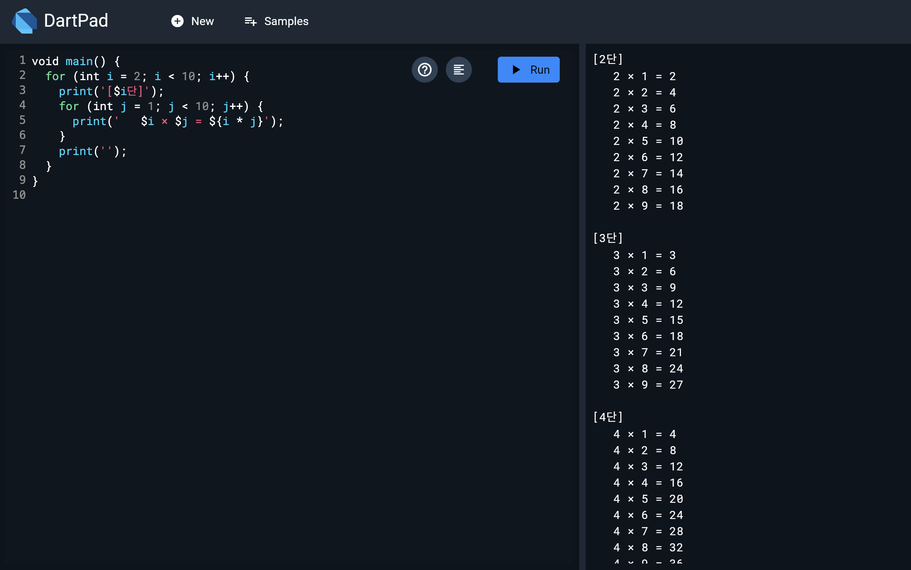
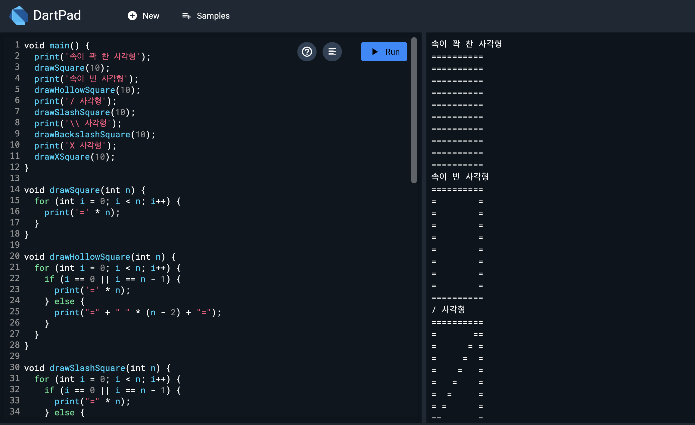
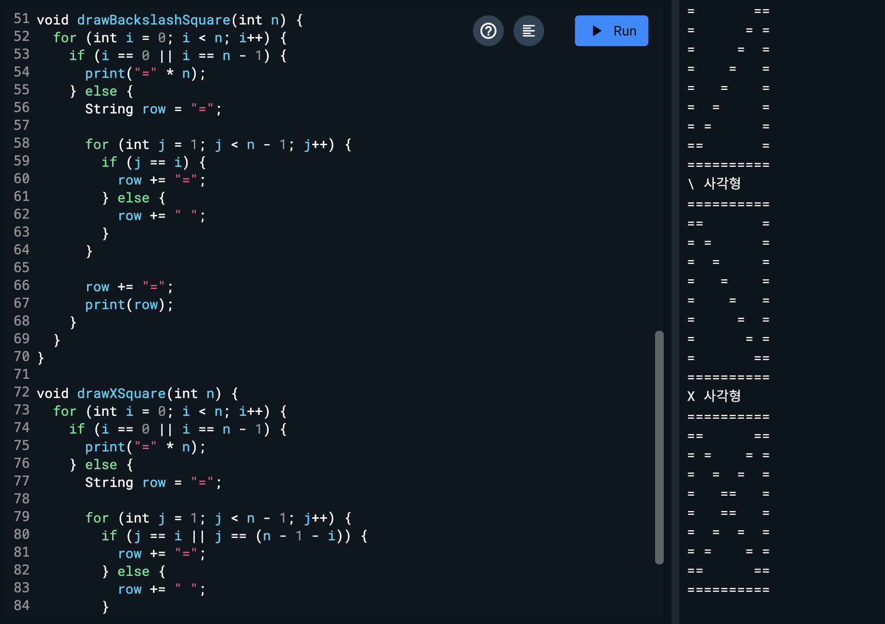
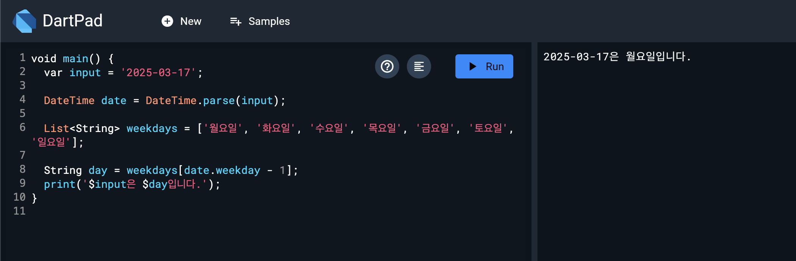

# 📌 Dart 예제 모음

> 🗓️ 작성일: 2025-03-17  
> 📂 카테고리: Dart

---

## 🧠 학습 개요

- Dart 기초 문법을 연습하기 위해 다양한 예제를 실행
- 구문, 출력 형식, 로직 표현 방식에 익숙해지기 위한 연습

---

## 📌 핵심 개념 정리

- **구구단 출력**: 반복문 및 문자열 출력 활용
- **사각형 그리기**: 이중 반복문을 이용한 패턴 표현
- **요일 추출**: `DateTime` 또는 조건문을 활용한 요일 계산

---

## 💡 주요 예제 & 결과

### ✅ 구구단
- 2단부터 9단까지 출력
- 반복문(for)을 중첩하여 계산

---

### ✅ 사각형 만들기
- 정사각형 또는 직사각형을 패턴으로 출력
- 중첩 반복문의 기본 활용 예시

  

---

### ✅ 요일 추출하기
- 날짜를 기준으로 요일을 계산하는 로직 실습
- 현재 날짜나 임의 날짜를 기준으로 결과 출력

---

## 🧩 시행착오 / 오류 메모

- 이미지가 잘 안 보일 경우 경로 확인 필요
- Dart의 `DateTime` 관련 클래스 문법 숙지 필요

---

## 🔁 다시 본다면?

- 각 예제의 실제 코드도 함께 기록하면 더 좋을 것 같음
- 이후에는 `List`, `Map`, `Class` 관련 예제도 추가할 예정

---

## 📚 참고 자료

- [Dart 공식 문서](https://dart.dev/guides)