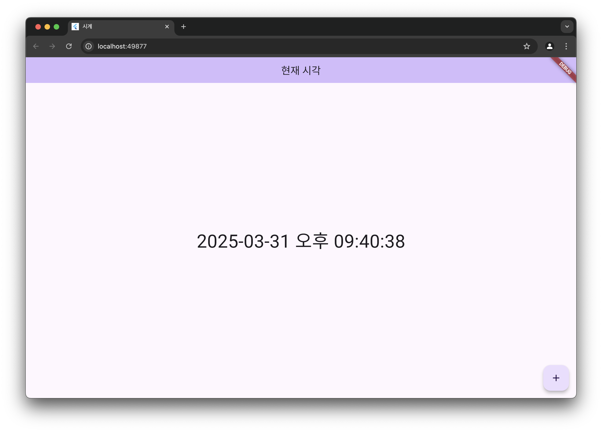

# 🕒 Flutter 실시간 시계 앱

Flutter로 만든 간단한 **실시간 시계 앱**입니다.  
현재 시간을 한국어 포맷으로 표시하며, 1초마다 자동 갱신됩니다.  
`intl` 패키지를 사용하여 날짜/시간 형식을 현지화했습니다.

---

## 📱 주요 기능

- 현재 시간을 `yyyy-MM-dd a hh:mm:ss` 형식으로 한국어(`ko`)로 표시
- 매초 시간 자동 업데이트
- `+` 버튼 클릭 시 즉시 시간 갱신 (수동 업데이트)

---

## 📦 사용한 패키지

- [flutter/material.dart](https://api.flutter.dev/flutter/material/material-library.html): 기본 Flutter 위젯
- [intl](https://pub.dev/packages/intl): 날짜/시간 포맷 및 현지화 지원

## 🔹 Code

```dart
import 'dart:async';

import 'package:flutter/material.dart';
import 'package:intl/intl.dart';
import 'package:intl/date_symbol_data_local.dart';

void main() {
  runApp(const MyApp());
  initializeDateFormatting('ko', null); // ← 로케일 초기화
}

class MyApp extends StatelessWidget {
  const MyApp({super.key});

  // This widget is the root of your application.
  @override
  Widget build(BuildContext context) {
    return MaterialApp(
      title: '시계',
      theme: ThemeData(
        colorScheme: ColorScheme.fromSeed(seedColor: Colors.deepPurple),
      ),
      home: const MyHomePage(title: '현재 시각'),
    );
  }
}

class MyHomePage extends StatefulWidget {
  const MyHomePage({super.key, required this.title});


  final String title;

  @override
  State<MyHomePage> createState() => _MyHomePageState();
}

class _MyHomePageState extends State<MyHomePage> {
  late Timer _timer;         // 타이머 변수
  DateTime _now = DateTime.now();

  @override
  void initState() {
    super.initState();

    // 1초마다 현재 시간 갱신
    _timer = Timer.periodic(const Duration(seconds: 1), (timer) {
      setState(() {
        _now = DateTime.now();
      });
    });
  }
  void _ticktock() {
    setState(() {
      _now = DateTime.now();
    });
  }

  @override
  Widget build(BuildContext context) {
    return Scaffold(
      appBar: AppBar(
        backgroundColor: Theme.of(context).colorScheme.inversePrimary,
        title: Text(widget.title),
      ),
      body: Center(
        child: Text(
          DateFormat('yyyy-MM-dd a hh:mm:ss', 'ko').format(_now),
          style: TextStyle(fontSize: 40),
        ),
      ),
      floatingActionButton: FloatingActionButton(
        onPressed: _ticktock,
        tooltip: 'Increment',
        child: const Icon(Icons.add),
      ), // This trailing comma makes auto-formatting nicer for build methods.
    );
  }
}

```

## 💻 실행 화면


