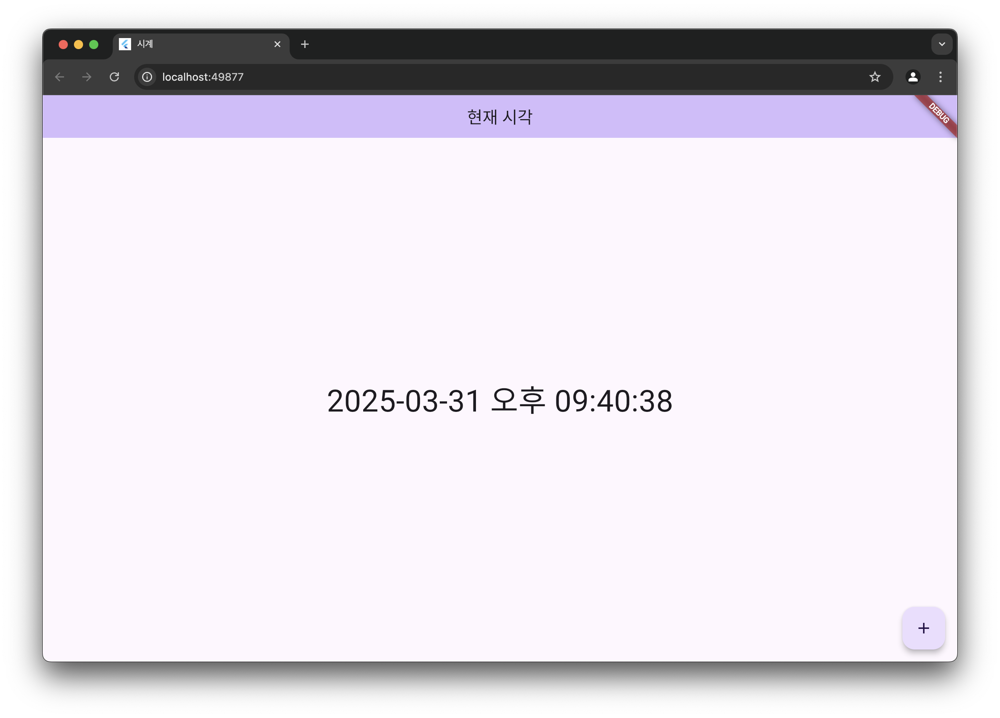

# 📌 Flutter 실시간 시계 앱 만들기

> 🗓️ 작성일: 2025-03-31  
> 📂 카테고리: Flutter

---

## 🧠 학습 개요

- Flutter로 실시간으로 갱신되는 시계 앱을 만들며 상태 관리와 시간 포맷 학습
- `intl` 패키지를 사용하여 한국어 포맷 적용

---

## 📌 핵심 개념 정리

- `DateTime.now()`: 현재 시간을 가져오는 메서드
- `Timer.periodic`: 일정 주기마다 상태 갱신
- `DateFormat`: 날짜/시간 포맷 지정
- `StatefulWidget`: 시간 상태를 지속적으로 갱신하기 위한 구조

---

## 💡 주요 코드 & 예제

```dart
void initState() {
  super.initState();

  // 1초마다 현재 시간 갱신
  _timer = Timer.periodic(const Duration(seconds: 1), (timer) {
    setState(() {
      _now = DateTime.now();
    });
  });
}
```

- `+` 버튼 클릭 시 수동 시간 갱신도 가능

---

## 🧩 시행착오 / 오류 메모

- `intl` 사용 전에는 `initializeDateFormatting()`을 호출해야 포맷 적용 가능
- 위젯 상태 갱신은 반드시 `setState()` 안에서 처리해야 함

---

## 🔁 다시 본다면?

- 타이머 해제 (`dispose`) 처리가 빠져 있으므로 추가 필요
- 상태 관리 방식(예: Provider, Riverpod 등)으로 확장해볼 수 있음

---

## 📚 참고 자료

- [intl 패키지 문서](https://pub.dev/packages/intl)
- [Flutter Timer 공식 예제](https://api.flutter.dev/flutter/dart-async/Timer/Timer.periodic.html)

---

## 💻 실행 화면

