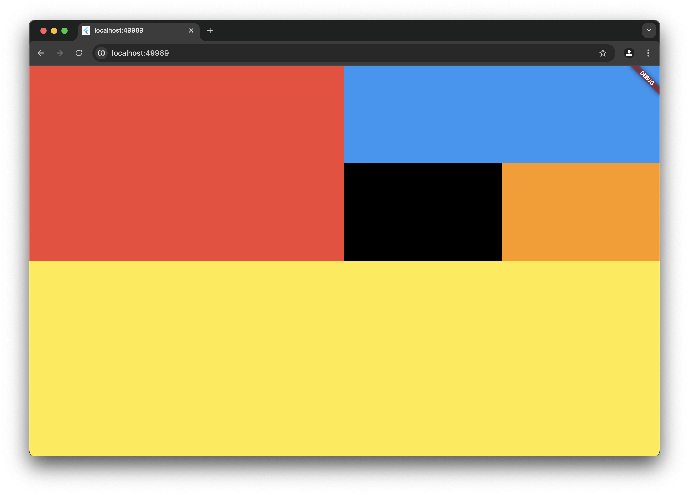

# 📌 Flutter 화면 전체 레이아웃 구성하기

> 🗓️ 작성일: 2025-04-13  
> 📂 카테고리: Flutter

---

## 🧠 학습 개요

- `Column`, `Row`, `Expanded`를 활용하여 복잡한 레이아웃 구성 연습  
- `SizedBox`를 제거하고 위젯을 화면 전체에 맞게 확장하는 방법 학습

---

## 📌 핵심 개념 정리

- `Expanded`: 남은 공간을 비율에 따라 나누어 사용하도록 하는 위젯  
- `Row` / `Column`: 수평, 수직 방향으로 자식 위젯을 배치  
- `Scaffold.body`: 앱 화면의 주 내용이 들어가는 부분  
- `SafeArea`: 노치 영역 등 시스템 UI와 겹치지 않게 해주는 위젯 (선택사항)

---

## 💡 주요 코드 & 예제

```dart
import 'package:flutter/material.dart';

void main() => runApp(const MyApp());

class MyApp extends StatelessWidget {
  const MyApp({super.key});

  @override
  Widget build(BuildContext context) {
    return MaterialApp(
      home: Scaffold(
        backgroundColor: Colors.grey[300],
        body: Column(
          children: [
            Expanded(
              flex: 2,
              child: Row(
                children: [
                  Expanded(
                    flex: 2,
                    child: Container(color: Colors.red),
                  ),
                  Expanded(
                    flex: 2,
                    child: Column(
                      children: [
                        Expanded(
                          flex: 1,
                          child: Container(color: Colors.blue),
                        ),
                        Expanded(
                          flex: 1,
                          child: Row(
                            children: [
                              Expanded(
                                child: Container(color: Colors.black),
                              ),
                              Expanded(
                                child: Container(color: Colors.orange),
                              ),
                            ],
                          ),
                        ),
                      ],
                    ),
                  ),
                ],
              ),
            ),
            Expanded(
              flex: 2,
              child: Container(color: Colors.yellow),
            ),
          ],
        ),
      ),
    );
  }
}
```
---

## 🧩 시행착오 / 오류 메모

- `SizedBox(width: 300, height: 300)`를 사용하면 전체 화면 사용이 제한됨  
- `Center`와 `SizedBox`를 쓰면 레이아웃이 고정되어버림  
- 화면 전체에 맞추려면 `Column`을 최상위에 두고 `Expanded`로 구성

---

## 🔁 다시 본다면?

- `SafeArea`를 사용하면 노치나 상단 상태바 겹침 문제 예방 가능  
- `LayoutBuilder`, `MediaQuery`를 활용하면 다양한 화면 크기에 대응 가능  
- 레이아웃을 Widget으로 분리하면 가독성과 재사용성 ↑

---

## 📚 참고 자료

- [Flutter Layout 공식 문서](https://docs.flutter.dev/development/ui/layout)  
- [Column 위젯 문서](https://api.flutter.dev/flutter/widgets/Column-class.html)  
- [Expanded 위젯 문서](https://api.flutter.dev/flutter/widgets/Expanded-class.html)

---

## 💻 실행 화면
