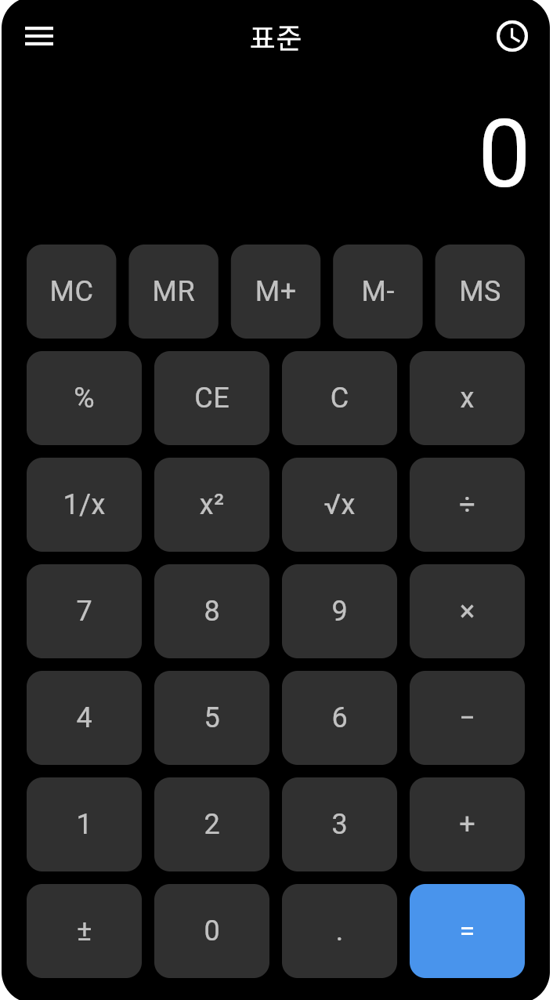

# 📌 Flutter 계산기 앱 만들기

> 🗓️ 작성일: 2025-04-13  
> 📂 카테고리: Flutter

---

## 🧠 학습 개요

- Flutter로 계산기 UI를 만들고, 다양한 레이아웃 위젯과 스타일링 방법을 학습
- `FittedBox`, `Container`, `Column`, `Row`, `Expanded`와 같은 Flutter 레이아웃 위젯을 사용하여 계산기 화면 구성

---

## 📌 핵심 개념 정리

- `FittedBox`: 자식 위젯의 크기를 부모 위젯에 맞게 자동으로 조정
- `Expanded`: 자식 위젯을 확장하여 남은 공간을 채우는 위젯
- `BoxDecoration`: 위젯의 스타일을 정의하는 데 사용되는 클래스
- `Column`과 `Row`: 세로와 가로 방향으로 위젯을 배열하는 위젯

---

## 💡 주요 코드 & 예제

```dart
class CalculatorApp extends StatelessWidget {
  const CalculatorApp({super.key});

  @override
  Widget build(BuildContext context) {
    return MaterialApp(
      debugShowCheckedModeBanner: false,
      home: Scaffold(
        backgroundColor: Colors.white, // 바깥 배경은 흰색
        body: Center(
          child: FittedBox( // 화면 크기에 맞게 줄이거나 키움
            child: Container(
              width: 350,
              padding: const EdgeInsets.all(12),
              decoration: BoxDecoration(
                color: Colors.black,
                borderRadius: BorderRadius.circular(20),
              ),
              child: const CalculatorBody(),
            ),
          ),
        ),
      ),
    );
  }
}
```
## 🧩 시행착오 / 오류 메모

- `FittedBox`를 사용하면 위젯의 크기를 화면에 맞게 자동으로 조정할 수 있지만, 일부 위젯은 원하는 크기와 맞지 않을 수 있음  
- `Expanded`로 버튼들이 충분히 공간을 차지하도록 조정할 때, `mainAxisSize`를 설정하지 않으면 예상치 못한 레이아웃 결과가 나올 수 있음  
- `Container`에 `padding`을 적용할 때, `FittedBox`와 함께 사용 시 버튼들이 너무 작아지거나 크기가 비정상적으로 설정될 수 있음  

---

## 🔁 다시 본다면?

- `Column`과 `Row`를 적절히 사용하여 계산기 버튼을 정렬하고, `Expanded`를 사용하여 버튼의 크기를 고르게 분배하는 것이 중요  
- `FittedBox`를 사용하면 화면 크기나 해상도에 따라 유동적인 디자인을 만들 수 있음  
- `Container`의 스타일링을 보다 세밀하게 조정해줌으로써 UI를 더욱 정밀하게 조정할 수 있음

---

## 📚 참고 자료

- [Flutter Layout 공식 문서](https://docs.flutter.dev/development/ui/layout)  
- [BoxDecoration 공식 문서](https://api.flutter.dev/flutter/painting/BoxDecoration-class.html)  
- [Column 위젯 문서](https://api.flutter.dev/flutter/widgets/Column-class.html)  
- [Expanded 위젯 문서](https://api.flutter.dev/flutter/widgets/Expanded-class.html)

---

## 💻 실행 화면
